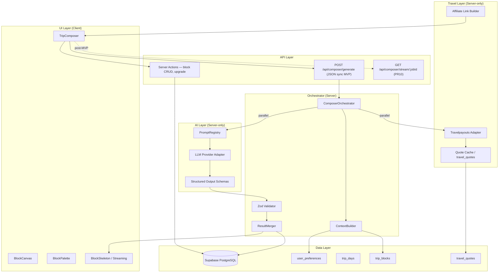
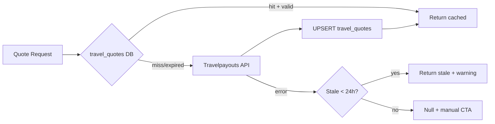
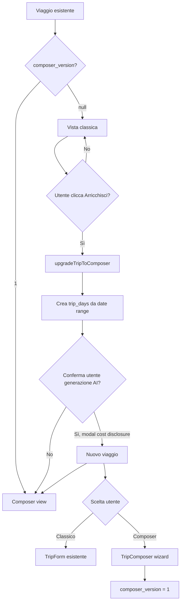
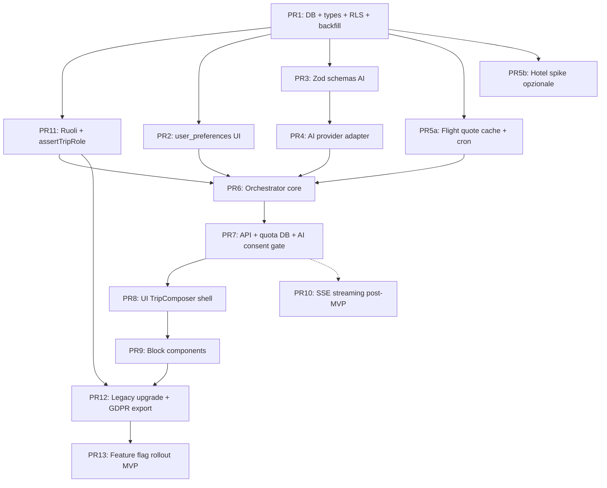

# NomadLink — Architettura Trip Composer

**Versione:** 1.1 (post-review round 2)  
**Data:** 10 luglio 2026  
**Progetto:** NomadLink (`/Users/robuntitled/Desktop/Projects/nomadlink-app`)  
**Stack:** Next.js 15 App Router · React 19 · TypeScript · Tailwind 4 · NextAuth v5 · Supabase PostgreSQL · Zod · Vitest  
**Live:** https://webapp-bice-six-42.vercel.app  
**Repo:** github.com/robuntitled/webapp

---

## 1. Panoramica

NomadLink evolve da un form manuale di creazione viaggio (`TripForm`) a un **Trip Composer** block-based: l'utente compone il viaggio giorno per giorno (Giorno 1, Giorno 2, …) interagendo con blocchi logici (volo, hotel, attrazione, trasporto, pasto, nota libera).

Il flusso target:

```
UI (blocco) → Orchestrator server → [AI parallelo + Travel API parallelo] → aggiornamento UI progressivo in 2–5s
```

**Regola fondamentale:** l'AI genera solo contenuti creativi e strutturati (attrazioni, itinerari, alternative, copy contestuale). **Mai** voli, hotel o prezzi — quelli arrivano esclusivamente da API travel verificate (fase 1: Travelpayouts; fase 2 opzionale: Duffel).

**Value prop vs ChatGPT:** contesto utente persistente + UI strutturata + dati travel verificati + collaborazione multi-utente.

---

## 2. Stato attuale (verificato nel codebase)

### 2.1 Creazione viaggio manuale

| Componente | Path | Ruolo |
|---|---|---|
| Form creazione | `components/trips/TripForm.tsx` | Titolo, destinazione, date, prezzo manuale, immagini Pexels, stima volo |
| Pagina crea | `app/(main)/dashboard/crea/page.tsx` | Wrapper server che monta `TripForm` + `createTrip` |
| Server action | `actions/trips.ts` | `createTrip` / `updateTrip` via `supabaseAdmin` + Zod |
| Validazione | `lib/validations/trip.ts` | `createTripSchema` — nessun campo giorno/blocco |
| Tipi | `types/trip.ts` | `TripWithRelations` — flat, senza giorni/blocchi |

### 2.2 Database esistente

Tabelle attuali (inferite da query e RLS):

- `users` — profilo + consensi GDPR (`002_gdpr_consent.sql`)
- `trips` — metadati flat (`title`, `destination`, `price`, date, partecipanti, età)
- `trip_participants` — iscrizione semplice (`user_id`, `trip_id`), nessun ruolo
- `favorite_trips`

RLS in `supabase/migrations/001_security_rls.sql` (**autoritativo**):
- Lettura pubblica `trips` e `trip_participants`
- Scritture solo via `supabaseAdmin` (service_role) nelle server actions dopo verifica NextAuth
- **Nota:** `supabase/rls-policies.sql` è legacy (pattern Supabase Auth con `auth.uid()`); non applicarlo in prod — usare solo `001_security_rls.sql`
- **Nota operativa:** le migration vanno applicate con `npm run db:security` / `npm run db:gdpr` se non già fatto su Supabase prod

### 2.3 Auth e GDPR (da preservare)

| File | Pattern |
|---|---|
| `auth.ts` + `auth.config.ts` | Google, Facebook, Credentials |
| `middleware.ts` | Redirect a `/completa-registrazione` se `privacyConsentAccepted` mancante |
| `actions/privacy.ts` | Gestione diritti GDPR |
| `components/legal/*` | Cookie banner, consensi, documenti legali |

### 2.4 Integrazione Travelpayouts (fase 1 avviata)

| File | Ruolo |
|---|---|
| `lib/travelpayouts/config.ts` | Marker, WL subdomain/widget, `buildMarkerParam` per SubID |
| `lib/travelpayouts/data-api.ts` | `fetchCheapestFlightQuote` — cache Data API, `next: { revalidate: 3600 }` |
| `lib/travelpayouts/flight-search.ts` | Deep link White Label con `tripId` come SubID |
| `app/api/travel/estimate/route.ts` | Endpoint REST per stima prezzo in `TripForm` |
| `components/travel/FlightPriceEstimate.tsx` | UI stima in creazione viaggio |
| `components/travel/TripBookingSection.tsx` | Sezione prenotazione su dettaglio viaggio |

**Nessuna integrazione AI/LLM** presente nel repo.

### 2.5 Pattern architetturali esistenti da riusare

- **Server actions** (`'use server'`) per mutazioni autenticate
- **`server-only`** su moduli sensibili (`lib/travelpayouts/data-api.ts`)
- **Zod** per validazione input (`lib/validations/`)
- **Vitest** per test unitari (`lib/travelpayouts/*.test.ts`, `lib/validations/trip.test.ts`)
- **Rate limit in-memory** (`lib/rate-limit.ts`) — usato solo in `register`; **non** per composer (Vercel serverless multi-instance). Composer usa quote DB/KV (§7.5)
- **UI kit Radix/shadcn** in `components/ui/`

---

## 3. Architettura target

### 3.1 Diagramma dei layer



### 3.2 Separazione delle responsabilità

| Layer | Responsabilità | Vietato |
|---|---|---|
| **UI** | Composizione blocchi, drag-and-drop, stato ottimistico, skeleton per blocco | Chiamate dirette a LLM o Travel API |
| **Orchestrator** | Costruzione contesto, dispatch parallelo, merge risultati, persistenza, rate limit | Logica di rendering |
| **AI** | Generazione JSON strutturato (attrazioni, copy, alternative) | Prezzi, orari volo, disponibilità hotel |
| **Travel** | Quote voli/hotel, deep link affiliate, cache | Generazione testi creativi |
| **Data** | Persistenza, RLS, versioning blocchi | Business logic |

### 3.3 Flusso di generazione (happy path)

```mermaid
sequenceDiagram
    participant U as Utente
    participant UI as TripComposer
    participant API as /api/composer/generate
    participant O as Orchestrator
    participant AI as AI Layer
    participant T as Travel Layer
    participant DB as Supabase

    U->>UI: "Suggerisci giornata" su Giorno 2
    UI->>UI: Mostra skeleton sui blocchi target
    UI->>API: POST { tripId, dayIndex, intent, blockTypes[] }
    API->>O: orchestrateDayGeneration()
    O->>DB: Idempotency check + contesto (no dietary_restrictions)
    par Fetch parallelo (MVP: solo voli)
        O->>AI: generateDayBlocks(context)
        O->>T: fetchFlightQuote()
    end
    AI-->>O: DayBlocksSchema (JSON validato)
    T-->>O: TravelQuote[] (cache o API; hotel = WL link MVP)
    O->>O: merge — AI blocks + travel quotes su blocchi flight
    O->>DB: UPSERT trip_blocks + travel_quotes + idempotency key
    O-->>API: { blocks, warnings, latencyMs }
    API-->>UI: Risposta JSON sincrona (MVP)
    UI->>UI: Sostituisce skeleton con blocchi reali
    Note over UI: Target P95: 2–5s end-to-end
```

---

## 4. Key Decisions

### KD-1: Estensione incrementale del modello dati, non rewrite

**Decisione:** Aggiungere tabelle `trip_days`, `trip_blocks`, `user_preferences`, `travel_quotes`; estendere `trip_participants` con `role`. La tabella `trips` resta la root entity con campi legacy intatti.

**Rationale:** I viaggi esistenti creati via `TripForm` continuano a funzionare. `TripCard`, `TripDetailPage`, affiliate links non si rompono. Migrazione lazy: viaggi senza giorni mostrano la vista classica + CTA "Passa al composer".

### KD-2: Orchestrator monolitico server-side (no microservizi)

**Decisione:** Un modulo `lib/composer/orchestrator.ts` invocato da Route Handlers Next.js. Parallelismo via `Promise.allSettled`. Nessuna coda Redis/job worker in fase 1. **MVP:** risposta JSON sincrona + skeleton client-side; SSE (PR10) post-MVP.

**Rationale:** Il team è di 2 dev; Vercel serverless gestisce burst moderati. La latenza target 2–5s è compatibile con request/response sincrona. SSE richiede job store durabile (DB/KV) tra invocazioni serverless — differito a fase 1.5. Job queue solo se P95 > 8s o rate limit provider superato sistematicamente.

### KD-3: AI via structured output + Zod strict

**Decisione:** Tutte le risposte AI passano da schemi Zod in `lib/composer/schemas/`. Usare `response_format: json_schema` (OpenAI) o equivalente. Retry automatico (max 2) su validation failure.

**Rationale:** Allineato al pattern esistente in `lib/validations/trip.ts`. Elimina parsing fragile. L'AI non può "inventare" un prezzo se lo schema non include campi `price` per blocchi creativi.

### KD-4: Travel quotes separati dai blocchi AI

**Decisione:** I blocchi `flight` e `hotel` hanno `content` generato dall'AI (descrizione, consigli) ma `travel_quote_id` punta a `travel_quotes` con dati API.

**Rationale:** Separazione netta anti-allucinazione. Il UI mostra badge "Prezzo verificato" solo se `travel_quote_id` presente e `expires_at` valido.

### KD-5: Streaming a livello blocco, non full-page

**Decisione:** **MVP (fase 1):** risposta JSON unica con skeleton client-side — **non** blocca rollout (PR13). **Fase 1.5 (PR10, opzionale):** SSE con job store in tabella `composer_jobs` o Vercel KV; emette `{ type: 'block_ready', block }` man mano che AI e Travel completano.

**Rationale:** Progressive enhancement. Il pattern skeleton è già usabile con `components/ui/card.tsx` + stati loading in `TripForm` (Pexels search). SSE su Vercel serverless richiede storage durabile tra POST handler e subscriber — non nel critical path MVP.

### KD-6: Cache travel_quotes in PostgreSQL, non solo Next.js fetch cache

**Decisione:** Tabella `travel_quotes` con TTL (`expires_at`), chiave composita `cache_key` che include tutti i parametri di ricerca rilevanti. L'adapter Travelpayouts controlla DB prima di chiamare API.

**Cache key format (voli):**
```
flight:{origin}:{dest_iata}:{depart}:{return}:{adults}:{children}:{infants}:{currency}
```
`travelClass` omesso intenzionalmente — Data API `/prices/cheap` non lo supporta.

**Rationale:** `data-api.ts` usa già `next: { revalidate: 3600 }` ma la cache Next.js è per-request e non condivisa tra utenti. Cache DB riduce costi API e latenza su destinazioni popolari (mercato italiano: ROM, MXP, BGY → capitali EU). Includere `currency` e passeggeri evita collisioni tra configurazioni diverse.

### KD-7: Ruoli collaborativi su `trip_participants`

**Decisione:** Enum `role`: `owner` | `editor` | `viewer`. **`trips.creator_id` è autoritativo per owner** — `assertTripRole` controlla prima `creator_id`, poi `trip_participants.role`. Migration inserisce righe owner mancanti (i creator non sono mai in `trip_participants` oggi). Inviti futuri via link — fase 2.

**Rationale:** Minimo viable per collaborazione senza sistema inviti complesso. Il backfill UPDATE su participant esistenti non basta: `createTrip` non inserisce il creator in `trip_participants`. RLS e server actions verificano ruolo prima di mutare `trip_blocks`.

### KD-8: Feature flag per rollout graduale

**Decisione:** Due segnali con responsabilità distinte (no drift):
- **`COMPOSER_ENABLED`** (env): gate globale — route composer e API `/api/composer/*` restituiscono 404 se `false`
- **`trips.composer_version`** (`null` | `1`): gate per-viaggio — `null` = vista classica; `>= 1` = composer

Route `/dashboard/crea` mostra scelta "Creazione classica" / "Composer AI" solo se `COMPOSER_ENABLED=true`.

**Rationale:** Zero downtime per utenti esistenti. Flag globale per kill-switch deploy; versione per-viaggio per migrazione lazy.

### KD-9: Provider AI astratto, default OpenAI GPT-4o-mini

**Decisione:** `lib/ai/provider.ts` con interfaccia `generateStructured<T>(schema, prompt)`. Env `AI_PROVIDER=openai`, `OPENAI_API_KEY`.

**Rationale:** Nessun vendor lock-in nel codice. GPT-4o-mini offre buon rapporto costo/latenza per JSON strutturato in italiano. **Non** committare API key — seguire pattern `.env.example`.

### KD-10: GDPR — AI processing come nuovo trattamento

**Decisione:** Aggiornare informativa privacy; consenso esplicito per "suggerimenti AI" (distinto da marketing). Schema in migration PR1:
- `users.ai_suggestions_consent_at timestamptz`
- `users.ai_policy_version text`
- Tabella `ai_generation_logs` (no prompt in chiaro fase 1)

**Fail-closed:** orchestrator e `/api/composer/generate` rifiutano se `ai_suggestions_consent_at IS NULL` — gate server obbligatorio da PR7.

**Consenso UI (PR7, non differito):** stub minimo in PR7 — `AiConsentModal.tsx` o riuso pattern `ConsentCheckboxes.tsx` — checkbox one-time prima del primo "Suggerisci giornata"; copy legale completa e informativa in PR12. Evita composer shell rotto su preview PR8–PR11.

**Dati speciali:** `user_preferences.dietary_restrictions` è health-adjacent — **escluso dal contesto AI in MVP** (§7.2, §13); raccolta in PR2 solo per uso futuro/manuale con copy esplicita "non inviato all'AI".

**Rationale:** Team italiano, utenti EU. Il middleware GDPR (`middleware.ts`) e `002_gdpr_consent.sql` sono già solidi — estendere, non sostituire.

---

## 5. Modello dati esteso

### 5.1 Diagramma ER

```mermaid
erDiagram
    users ||--o{ trips : creates
    users ||--o| user_preferences : has
    users ||--o{ trip_participants : joins
    trips ||--o{ trip_days : contains
    trips ||--o{ trip_participants : has
    trip_days ||--o{ trip_blocks : contains
    trip_blocks }o--o| travel_quotes : references
    users ||--o{ favorite_trips : favorites
    trips ||--o{ favorite_trips : favorited

    users {
        uuid id PK
        text email
        boolean privacy_consent
        timestamptz privacy_consent_at
    }

    user_preferences {
        uuid user_id PK_FK
        text[] interests
        text pace
        text budget_tier
        text default_origin_iata
        jsonb dietary_restrictions
        timestamptz updated_at
    }

    trips {
        uuid id PK
        uuid creator_id FK
        text title
        text destination
        numeric price
        date start_date
        date end_date
        int composer_version
        text status
    }

    trip_days {
        uuid id PK
        uuid trip_id FK
        int day_index
        date day_date
        text title
        text summary
    }

    trip_blocks {
        uuid id PK
        uuid trip_day_id FK
        int sort_order
        text block_type
        jsonb content
        uuid travel_quote_id FK
        text ai_generated_by
        timestamptz created_at
        timestamptz updated_at
    }

    travel_quotes {
        uuid id PK
        text quote_type
        text provider
        text cache_key
        jsonb payload
        timestamptz fetched_at
        timestamptz expires_at
    }

    trip_participants {
        uuid trip_id FK
        uuid user_id FK
        text role
        timestamptz joined_at
    }
```

### 5.2 Migration SQL (`003_trip_composer.sql`)

```sql
-- Enum block types
CREATE TYPE block_type AS ENUM (
  'flight', 'hotel', 'attraction', 'transport',
  'meal', 'free_time', 'note', 'activity'
);

CREATE TYPE participant_role AS ENUM ('owner', 'editor', 'viewer');

-- AI consent (GDPR — fail-closed gate in orchestrator)
ALTER TABLE users
  ADD COLUMN IF NOT EXISTS ai_suggestions_consent_at timestamptz,
  ADD COLUMN IF NOT EXISTS ai_policy_version text;

-- User preferences (profilazione AI — health-adjacent PII)
CREATE TABLE user_preferences (
  user_id uuid PRIMARY KEY REFERENCES users(id) ON DELETE CASCADE,
  interests text[] DEFAULT '{}',
  pace text DEFAULT 'moderate' CHECK (pace IN ('relaxed', 'moderate', 'intense')),
  budget_tier text DEFAULT 'mid' CHECK (budget_tier IN ('budget', 'mid', 'premium')),
  default_origin_iata char(3) DEFAULT 'ROM',
  dietary_restrictions jsonb DEFAULT '[]',
  updated_at timestamptz DEFAULT now()
);

-- Trip composer metadata
ALTER TABLE trips
  ADD COLUMN IF NOT EXISTS composer_version smallint,
  ADD COLUMN IF NOT EXISTS status text DEFAULT 'draft'
    CHECK (status IN ('draft', 'published', 'archived'));

-- Backfill: viaggi pre-esistenti restano pubblicati (evita draft implicito su legacy)
UPDATE trips SET status = 'published' WHERE composer_version IS NULL;

-- Invariante legacy: nuovi TripForm (composer_version NULL) → sempre published
-- Il DEFAULT 'draft' vale solo per composer wizard che setta esplicitamente draft
CREATE OR REPLACE FUNCTION trips_legacy_published_status()
RETURNS TRIGGER AS $$
BEGIN
  IF NEW.composer_version IS NULL THEN
    NEW.status := 'published';
  END IF;
  RETURN NEW;
END;
$$ LANGUAGE plpgsql;

CREATE TRIGGER trips_legacy_status_trigger
  BEFORE INSERT OR UPDATE OF composer_version, status ON trips
  FOR EACH ROW
  EXECUTE FUNCTION trips_legacy_published_status();

-- PR1/PR12: createTrip/updateTrip legacy devono anche passare status='published'
-- (defense in depth oltre al trigger). Vitest: insert con composer_version NULL → published.

CREATE TABLE trip_days (
  id uuid PRIMARY KEY DEFAULT gen_random_uuid(),
  trip_id uuid NOT NULL REFERENCES trips(id) ON DELETE CASCADE,
  day_index int NOT NULL CHECK (day_index >= 1),
  day_date date NOT NULL,
  title text,
  summary text,
  UNIQUE (trip_id, day_index)
);

CREATE TABLE travel_quotes (
  id uuid PRIMARY KEY DEFAULT gen_random_uuid(),
  quote_type text NOT NULL CHECK (quote_type IN ('flight', 'hotel')),
  provider text NOT NULL DEFAULT 'travelpayouts',
  cache_key text NOT NULL UNIQUE,
  payload jsonb NOT NULL,
  fetched_at timestamptz NOT NULL DEFAULT now(),
  expires_at timestamptz NOT NULL
);

CREATE INDEX travel_quotes_cache_key_idx ON travel_quotes(cache_key);
CREATE INDEX travel_quotes_expires_at_idx ON travel_quotes(expires_at);

CREATE TABLE trip_blocks (
  id uuid PRIMARY KEY DEFAULT gen_random_uuid(),
  trip_day_id uuid NOT NULL REFERENCES trip_days(id) ON DELETE CASCADE,
  sort_order int NOT NULL DEFAULT 0,
  block_type block_type NOT NULL,
  content jsonb NOT NULL DEFAULT '{}',
  travel_quote_id uuid REFERENCES travel_quotes(id) ON DELETE SET NULL,
  ai_generated_by text,
  created_at timestamptz DEFAULT now(),
  updated_at timestamptz DEFAULT now()
);

CREATE INDEX trip_blocks_day_order_idx ON trip_blocks(trip_day_id, sort_order);

-- AI generation audit log (no raw prompts fase 1)
CREATE TABLE ai_generation_logs (
  id uuid PRIMARY KEY DEFAULT gen_random_uuid(),
  user_id uuid NOT NULL REFERENCES users(id) ON DELETE CASCADE,
  user_id_hash text NOT NULL,
  trip_id uuid REFERENCES trips(id) ON DELETE SET NULL,
  day_id uuid REFERENCES trip_days(id) ON DELETE SET NULL,
  intent text NOT NULL,
  model text NOT NULL DEFAULT 'gpt-4o-mini',
  token_count int,
  cost_usd_estimate numeric(10, 6),
  latency_ms int,
  created_at timestamptz DEFAULT now()
);

CREATE INDEX ai_generation_logs_created_at_idx ON ai_generation_logs(created_at);
CREATE INDEX ai_generation_logs_user_hourly_idx ON ai_generation_logs(user_id, created_at);

-- Per-user daily cap (30/giorno) — rollup separato dal conteggio per-trip
CREATE TABLE ai_usage_quotas (
  user_id uuid NOT NULL REFERENCES users(id) ON DELETE CASCADE,
  quota_date date NOT NULL DEFAULT CURRENT_DATE,
  generation_count int NOT NULL DEFAULT 0,
  PRIMARY KEY (user_id, quota_date)
);

-- Per-trip daily cap (50/giorno per trip) — chiave composita corretta
CREATE TABLE ai_trip_generation_quotas (
  user_id uuid NOT NULL REFERENCES users(id) ON DELETE CASCADE,
  trip_id uuid NOT NULL REFERENCES trips(id) ON DELETE CASCADE,
  quota_date date NOT NULL DEFAULT CURRENT_DATE,
  generation_count int NOT NULL DEFAULT 0,
  PRIMARY KEY (user_id, trip_id, quota_date)
);

-- Platform monthly spend rollup (kill-switch AI_MONTHLY_BUDGET_USD)
CREATE TABLE ai_usage_monthly (
  month_start date PRIMARY KEY,
  generation_count int NOT NULL DEFAULT 0,
  total_cost_usd_estimate numeric(12, 4) NOT NULL DEFAULT 0,
  updated_at timestamptz DEFAULT now()
);

-- Idempotency durabile (serverless-safe — evita doppio spend su retry client)
CREATE TABLE composer_idempotency_keys (
  key_hash text PRIMARY KEY,
  user_id uuid NOT NULL REFERENCES users(id) ON DELETE CASCADE,
  trip_id uuid NOT NULL REFERENCES trips(id) ON DELETE CASCADE,
  day_id uuid REFERENCES trip_days(id) ON DELETE CASCADE,
  intent text NOT NULL,
  response_snapshot jsonb,
  created_at timestamptz DEFAULT now()
);

CREATE INDEX composer_idempotency_keys_created_at_idx ON composer_idempotency_keys(created_at);

-- Extend participants with roles
ALTER TABLE trip_participants
  ADD COLUMN IF NOT EXISTS role participant_role DEFAULT 'viewer',
  ADD COLUMN IF NOT EXISTS joined_at timestamptz DEFAULT now();

-- Backfill ruoli: UPDATE righe esistenti + INSERT owner mancanti
-- (createTrip non inserisce mai creator in trip_participants)
UPDATE trip_participants tp
SET role = 'owner'
FROM trips t
WHERE tp.trip_id = t.id AND tp.user_id = t.creator_id;

INSERT INTO trip_participants (trip_id, user_id, role)
SELECT t.id, t.creator_id, 'owner'
FROM trips t
WHERE NOT EXISTS (
  SELECT 1 FROM trip_participants tp
  WHERE tp.trip_id = t.id AND tp.user_id = t.creator_id
);

-- ── RLS (PR1 — non differire a fase 1.5) ─────────────────────────────────────

ALTER TABLE user_preferences ENABLE ROW LEVEL SECURITY;
ALTER TABLE trip_days ENABLE ROW LEVEL SECURITY;
ALTER TABLE trip_blocks ENABLE ROW LEVEL SECURITY;
ALTER TABLE travel_quotes ENABLE ROW LEVEL SECURITY;
ALTER TABLE ai_generation_logs ENABLE ROW LEVEL SECURITY;
ALTER TABLE ai_usage_quotas ENABLE ROW LEVEL SECURITY;
ALTER TABLE ai_trip_generation_quotas ENABLE ROW LEVEL SECURITY;
ALTER TABLE ai_usage_monthly ENABLE ROW LEVEL SECURITY;
ALTER TABLE composer_idempotency_keys ENABLE ROW LEVEL SECURITY;

-- Revoca accesso diretto client (pattern 001_security_rls.sql)
REVOKE ALL ON user_preferences FROM anon, authenticated;
REVOKE ALL ON trip_days FROM anon, authenticated;
REVOKE ALL ON trip_blocks FROM anon, authenticated;
REVOKE ALL ON travel_quotes FROM anon, authenticated;
REVOKE ALL ON ai_generation_logs FROM anon, authenticated;
REVOKE ALL ON ai_usage_quotas FROM anon, authenticated;
REVOKE ALL ON ai_trip_generation_quotas FROM anon, authenticated;
REVOKE ALL ON ai_usage_monthly FROM anon, authenticated;
REVOKE ALL ON composer_idempotency_keys FROM anon, authenticated;

-- SELECT trip_days/trip_blocks: trip published OR (futuro: participant check via service_role)
-- Fase 1: nessuna policy SELECT → solo service_role legge/scrive
-- Scritture INSERT/UPDATE/DELETE: solo service_role (server actions dopo NextAuth)

-- user_preferences: NESSUNA policy → zero accesso anon/authenticated
-- travel_quotes, ai_*: NESSUNA policy → service_role only (no leak pricing/PII)
```

### 5.3 Tipi TypeScript (`types/composer.ts`)

**Regola:** tipi derivati esclusivamente da Zod via `z.infer` — nessun alias `BlockContent` manuale (evita drift schema ↔ TS).

```typescript
import type { z } from 'zod';
import type { dayGenerationSchema } from '@/lib/composer/schemas/day-blocks';
import type { mergedBlockSchema } from '@/lib/composer/schemas/merged-block';

export type DayGeneration = z.infer<typeof dayGenerationSchema>;
export type MergedBlock = z.infer<typeof mergedBlockSchema>;
export type BlockType = MergedBlock['blockType'];

export type TripBlock = MergedBlock & {
  id: string;
  tripDayId: string;
  travelQuoteId: string | null;
  aiGeneratedBy: string | null;
};

export type TripDay = {
  id: string;
  tripId: string;
  dayIndex: number;
  dayDate: string;
  title: string | null;
  summary: string | null;
  blocks: TripBlock[];
};
```

### 5.4 Compatibilità viaggi legacy

| Scenario | Comportamento |
|---|---|
| `composer_version IS NULL` | Vista dettaglio attuale (`app/(main)/viaggi/[id]/page.tsx`) invariata |
| Utente clicca "Arricchisci con AI" | Server action crea `trip_days` da `start_date`/`end_date`, set `composer_version = 1` |
| `price` su `trips` | Resta il "prezzo pacchetto" per listing; composer calcola `estimated_total` dai `travel_quotes` come campo derivato (non persistito in fase 1) |

---

## 6. Schemi Zod per risposte AI

Directory: `lib/composer/schemas/`

**Nota Zod v4:** il progetto usa `zod ^4.4.3`. PR3 include contract test OpenAI `json_schema` ↔ `dayGenerationSchema` per verificare compatibilità structured output.

### 6.1 Schema generazione giornata

```typescript
// lib/composer/schemas/day-blocks.ts
import { z } from 'zod';

const attractionContentSchema = z.object({
  name: z.string().min(1).max(200),
  description: z.string().max(2000),
  estimatedDurationMinutes: z.number().int().min(15).max(480),
  neighborhood: z.string().max(100).optional(),
  tips: z.array(z.string().max(300)).max(5),
  tags: z.array(z.enum(['museum', 'nature', 'art', 'food', 'history', 'nightlife'])).max(5),
});

const transportContentSchema = z.object({
  mode: z.enum(['walk', 'metro', 'bus', 'taxi', 'train', 'ferry']),
  from: z.string().max(200),
  to: z.string().max(200),
  estimatedMinutes: z.number().int().min(1).max(300),
  instructions: z.string().max(1000),
});

const aiBlockSchema = z.discriminatedUnion('blockType', [
  z.object({ blockType: z.literal('attraction'), content: attractionContentSchema }),
  z.object({ blockType: z.literal('transport'), content: transportContentSchema }),
  z.object({ blockType: z.literal('meal'), content: z.object({
    mealType: z.enum(['breakfast', 'lunch', 'dinner', 'snack']),
    suggestion: z.string().max(500),
    cuisine: z.string().max(100).optional(),
  })}),
  z.object({ blockType: z.literal('free_time'), content: z.object({
    suggestion: z.string().max(500),
  })}),
  z.object({ blockType: z.literal('note'), content: z.object({
    text: z.string().max(2000),
  })}),
  z.object({ blockType: z.literal('activity'), content: z.object({
    title: z.string().max(200),
    description: z.string().max(1500),
  })}),
]);

export const dayGenerationSchema = z.object({
  dayTitle: z.string().max(120),
  daySummary: z.string().max(500),
  blocks: z.array(aiBlockSchema).min(1).max(12),
  alternatives: z.array(z.object({
    reason: z.string().max(200),
    blocks: z.array(aiBlockSchema).max(6),
  })).max(3).optional(),
});

export type DayGeneration = z.infer<typeof dayGenerationSchema>;
```

### 6.2 Schema contesto prompt (input, non output AI)

```typescript
// lib/composer/schemas/context.ts
export const composerContextSchema = z.object({
  destination: z.string(),
  dayDate: z.string(),
  dayIndex: z.number().int().positive(),
  totalDays: z.number().int().positive(),
  interests: z.array(z.string()),
  pace: z.enum(['relaxed', 'moderate', 'intense']),
  budgetTier: z.enum(['budget', 'mid', 'premium']),
  existingBlocksSummary: z.array(z.string()).max(50),
  locale: z.literal('it-IT'),
});
```

### 6.3 Blocchi flight/hotel — schema content (senza prezzo)

```typescript
// lib/composer/schemas/travel-blocks.ts
export const flightBlockContentSchema = z.object({
  headline: z.string().max(120),
  tips: z.array(z.string().max(200)).max(3),
  // NO price, NO flight number — arrivano da travel_quotes.payload
});

export const hotelBlockContentSchema = z.object({
  headline: z.string().max(120),
  areaRecommendation: z.string().max(300),
  tips: z.array(z.string().max(200)).max(3),
});
```

### 6.4 Validazione merge post-orchestrator

```typescript
// lib/composer/schemas/merged-block.ts
import { aiBlockSchema } from './day-blocks';
import { flightBlockContentSchema, hotelBlockContentSchema } from './travel-blocks';

const mergedTravelBlockSchema = z.discriminatedUnion('blockType', [
  z.object({ blockType: z.literal('flight'), content: flightBlockContentSchema }),
  z.object({ blockType: z.literal('hotel'), content: hotelBlockContentSchema }),
]);

export const mergedBlockSchema = z.discriminatedUnion('blockType', [
  ...mergedTravelBlockSchema.options,
  ...aiBlockSchema.options,
]).and(z.object({
  travelQuoteId: z.string().uuid().nullable(),
  sortOrder: z.number().int(),
}));
```

Discriminated union stretta — no `z.record(z.unknown())` post-merge.

---

## 7. Orchestrator

### 7.1 Modulo principale

Path: `lib/composer/orchestrator.ts`

```typescript
export type GenerateDayRequest = {
  tripId: string;
  dayId: string;
  userId: string;
  intent: 'suggest_day' | 'regenerate_block' | 'add_alternatives';
  targetBlockTypes?: BlockType[];
};

export async function orchestrateDayGeneration(req: GenerateDayRequest): Promise<OrchestratorResult> {
  // 0. Fail-closed: AI consent + quota check (§7.5)
  // 1. Auth + assertTripRole(tripId, userId, minRole: 'editor') — creator_id fallback (KD-7)
  // 2. Idempotency: lookup composer_idempotency_keys (key_hash = sha256(tripId|dayId|intent), TTL 120s)
  //    Se hit → return response_snapshot; se miss → INSERT key prima della chiamata LLM
  // 3. context = await buildContext(req) — legge user_preferences (PR2), trip, day, blocchi esistenti
  //    Esclude esplicitamente dietary_restrictions (§7.2, §13)
  // 4. Parallel:
  const [aiResult, travelResult] = await Promise.allSettled([
    generateDayBlocks(context),      // lib/ai/generate-day.ts
    fetchTravelQuotesForDay(context), // lib/travel/quote-service.ts — flight only MVP (PR5a)
  ]);
  // 5. mergeResults — AI blocks sempre; travel opzionale (warning se fail)
  // 6. validate con mergedBlockSchema[]
  // 7. persistBlocks() via supabaseAdmin; log ai_generation_logs (+ cost_usd_estimate);
  //    increment ai_usage_quotas + ai_trip_generation_quotas + ai_usage_monthly;
  //    UPDATE composer_idempotency_keys.response_snapshot
  // 8. return { blocks, warnings, latencyMs } — JSON sync (MVP)
}
```

### 7.2 Context Builder

Path: `lib/composer/context-builder.ts`

Aggrega (minimizzazione GDPR):
- `user_preferences`: **solo** `interests`, `pace`, `budget_tier`, `default_origin_iata`
- **Escluso esplicitamente:** `dietary_restrictions` — dato health-adjacent, mai inviato al LLM in MVP (ISSUE-029). Conservato in DB per uso UI futuro; richiederà consenso dedicato prima di inclusione in contesto AI (PR12+)
- Metadati trip da `trips` (destinazione, date — no PII creator)
- Blocchi giorni precedenti (riassunto testuale per evitare ripetizioni)
- Stagionalità da `day_date`
- Lingua: `it-IT` hardcoded fase 1 (mercato italiano)

`composerContextSchema` (§6.2) non include campo `dietaryRestrictions` — contract test PR3 verifica assenza.

### 7.3 AI Layer

| File | Ruolo |
|---|---|
| `lib/ai/provider.ts` | Interfaccia `AiProvider` |
| `lib/ai/openai.ts` | Implementazione OpenAI structured output |
| `lib/ai/prompts/day-generation.ts` | Template prompt in italiano |
| `lib/ai/generate-day.ts` | Invoca provider + valida `dayGenerationSchema` |

**Prompt guardrails (estratto):**
```
NON includere prezzi, numeri di volo, orari specifici o nomi di hotel reali.
Genera solo suggerimenti di attrazioni, trasporti e pasti.
Rispondi esclusivamente in JSON conforme allo schema fornito.
```

### 7.4 Travel Layer

| File | Ruolo | PR |
|---|---|---|
| `lib/travel/quote-service.ts` | Orchestrazione fetch + cache lookup | PR5a |
| `lib/travel/quote-cache.ts` | `getCachedQuote(cacheKey)` / `setCachedQuote()` su `travel_quotes` | PR5a |
| `lib/travelpayouts/data-api.ts` | **Esistente** — riusare `fetchCheapestFlightQuote` | PR5a |
| `lib/travelpayouts/hotel-api.ts` | **Spike opzionale** — Hotellook Data API (endpoint/auth diversi da flight) | PR5b |
| `lib/travelpayouts/flight-search.ts` | **Esistente** — `buildTripFlightSearchUrl` per CTA affiliate | — |

**Scope MVP (PR5a):** quote voli con cache DB. **PR5b (spike, non bloccante):** hotel quotes — fino a validazione API, blocchi hotel usano solo WL deep link (`buildTripHotelSearchUrl`) **senza** `travel_quote_id`.

**Gap noto:** `resolveDestinationIata` ritorna `null` per destinazioni non mappate — quote-service degrada a CTA manuale + warning.

**Cache key format:**
```
flight:{origin}:{dest_iata}:{depart}:{return}:{adults}:{children}:{infants}:{currency}
hotel:{dest_iata}:{checkin}:{checkout}:{guests}:{currency}  -- PR5b
```

**TTL:**
| Quote type | TTL | Fonte |
|---|---|---|
| Flight (cache API) | 1h | Allineato a `revalidate: 3600` in `data-api.ts` |
| Hotel | 2h | Hotellook cache (PR5b) |
| Fallback stale | +24h con badge "prezzo indicativo" | Se API down |

### 7.5 AI Cost Controls

Sostituisce `lib/rate-limit.ts` in-memory per route composer. **MVP: tutto DB-backed** — nessuna dipendenza KV obbligatoria.

| Controllo | Default | Implementazione |
|---|---|---|
| Per-user hourly | 10 generazioni/ora | **MVP (DB):** `COUNT(*) FROM ai_generation_logs WHERE user_id = $1 AND created_at > now() - interval '1 hour'`. **Opzionale prod:** Vercel KV `composer:rate:{userId}:{hour}` se `KV_REST_API_*` configurato — stesso limite, meno load DB |
| Per-user daily | 30 generazioni/giorno | `ai_usage_quotas.generation_count` — `PRIMARY KEY (user_id, quota_date)` |
| Per-trip daily | 50 generazioni/giorno | `ai_trip_generation_quotas.generation_count` — `PRIMARY KEY (user_id, trip_id, quota_date)` |
| Token ceiling | 4.000 output tokens/request | `max_tokens` in provider adapter |
| Retry budget | Max 2 retry Zod, poi fail | `generate-day.ts` |
| Monthly kill-switch | `AI_MONTHLY_BUDGET_USD=50` | Pre-call: `SELECT total_cost_usd_estimate FROM ai_usage_monthly WHERE month_start = date_trunc('month', now())`; increment atomico post-call. `cost_usd_estimate` per request in `ai_generation_logs` (formula: token_count × tariffa modello) |
| Consent gate | `ai_suggestions_consent_at IS NOT NULL` | Fail-closed in orchestrator step 0; stub UI in PR7 (`AiConsentModal`) |
| Idempotency | `sha256(tripId\|dayId\|intent)` | Tabella `composer_idempotency_keys` — TTL 120s; cleanup cron con `ai_generation_logs` |

**`lib/ai/quota.ts` (PR7):** `checkAndIncrementQuotas(userId, tripId)` — transazione atomica su tre tabelle quota + hourly COUNT; fail con `429` e messaggio UX.

**Env aggiuntivi** (`.env.example`): `COMPOSER_ENABLED`, `AI_PROVIDER`, `OPENAI_API_KEY`, `AI_MONTHLY_BUDGET_USD`, `KV_REST_API_URL`, `KV_REST_API_TOKEN` (**opzionale** — hourly burst via KV; senza KV si usa COUNT su `ai_generation_logs`).

---

## 8. UI Layer — Trip Composer

### 8.1 Struttura componenti

```
components/composer/
├── TripComposer.tsx          # Container principale
├── DayTimeline.tsx           # Lista giorni (Giorno 1, 2, …)
├── DayColumn.tsx             # Colonna singolo giorno
├── BlockCard.tsx             # Card blocco (varianti per blockType)
├── BlockSkeleton.tsx         # Loading state per blocco
├── BlockPalette.tsx          # Azioni: aggiungi blocco, rigenera, alternative
├── ComposerToolbar.tsx       # Salva, pubblica, anteprima
├── TravelQuoteBadge.tsx      # "Prezzo verificato" / "Indicativo"
└── hooks/
    ├── useComposerState.ts   # Stato locale + sync server
    └── useBlockGeneration.ts # Trigger generate — JSON sync MVP (SSE in PR10)
```

### 8.2 Route

| Route | Tipo | Descrizione |
|---|---|---|
| `/dashboard/crea` | Esistente | Aggiungere tab "Composer AI" (se `COMPOSER_ENABLED`) |
| `/dashboard/viaggi/[id]/modifica` | Esistente | Edit flat legacy (`TripForm`) — invariato per `composer_version IS NULL` |
| `/dashboard/viaggi/[id]/composer` | **Nuova** | Editor block-based — solo `composer_version >= 1` |
| `/viaggi/[id]` | Esistente | Se `composer_version >= 1`, mostra `DayTimeline` read-only |

**IA:** `modifica` = viaggio classico; `composer` = block editor. CTA "Passa al composer" da dettaglio/modifica dopo `upgradeTripToComposer`.

### 8.3 Stato e sincronizzazione

```mermaid
stateDiagram-v2
    [*] --> Idle
    Idle --> Generating : user clicks "Suggerisci"
    Generating --> Ready : JSON response (MVP)
    Ready --> Idle : blocks rendered
    Idle --> Saving : auto-save debounce 2s
    Saving --> Idle : persisted
    Generating --> Error : timeout / validation fail
    Error --> Idle : retry
    note right of Generating : PR10: branch SSE opzionale
```

**Pattern:** Optimistic UI per riordino blocchi (drag-and-drop); pesimistic per generazione AI (skeleton fino a conferma server JSON).

### 8.4 Streaming (fase 1.5 — PR10, post-MVP)

**Non nel critical path MVP.** PR13 rollout usa solo JSON sync + skeleton client.

Path: `app/api/composer/stream/[jobId]/route.ts`

**Job store:** tabella `composer_jobs` (id, user_id, trip_id, status, events jsonb[], created_at) o Vercel KV pub-sub — necessario perché POST handler e SSE subscriber possono atterrare su istanze serverless diverse.

Eventi SSE:
```typescript
type ComposerEvent =
  | { type: 'status'; message: string }
  | { type: 'block_ready'; block: TripBlock }
  | { type: 'travel_quote_ready'; blockId: string; quote: TravelQuote }
  | { type: 'complete'; latencyMs: number }
  | { type: 'error'; message: string };
```

Riusare pattern async iterator Next.js 15; timeout job 30s.

---

## 9. API Routes

### 9.1 Route handlers vs server actions

| Pattern | Uso | Esempio |
|---|---|---|
| **Server actions** | Mutazioni CRUD standard | `actions/composer.ts` — block reorder, upgrade, publish |
| **Route handlers** | Solo dove necessario | `POST /api/composer/generate` (timeout lungo, quota DB); SSE PR10 |

Auth condivisa: `lib/auth/assert-trip-role.ts` usato da actions e route handlers.

| Method | Path | Auth | Descrizione |
|---|---|---|---|
| `POST` | `/api/composer/generate` | Session + AI consent + quota | Generazione giorno — JSON sync MVP; `export const maxDuration = 15` (Hobby default 10s insufficiente per worst case 8s + cold start) |
| `GET` | `/api/composer/stream/[jobId]` | Session | SSE progressivo (PR10, post-MVP) |
| `GET` | `/api/trips/[id]/composer` | Session | Carica giorni + blocchi |
| — | Block CRUD | Server action | `reorderBlocks`, `deleteBlock` in `actions/composer.ts` |
| — | Upgrade | Server action | `upgradeTripToComposer` in `actions/composer.ts` |
| `GET` | `/api/travel/estimate` | **Session** (PR5a) | Stima volo — auth obbligatoria + IP rate limit; composer prefetch via `quote-cache` server-side, non client diretto |

Route composer: quota DB (§7.5), non `lib/rate-limit.ts` in-memory.

**`app/api/composer/generate/route.ts` (PR7):**
```typescript
export const maxDuration = 15; // Pro: 30 se worst case sistematico
// Hobby Vercel: max 10s hard cap — monitorare P95; upgrade Pro se breach
```

---

## 10. Caching strategy



**Pulizia:** Cron Vercel settimanale (PR5a scope):

`vercel.json`:
```json
{
  "crons": [{
    "path": "/api/cron/cleanup-quotes",
    "schedule": "0 3 * * 0"
  }]
}
```

`app/api/cron/cleanup-quotes/route.ts` — auth via header `Authorization: Bearer ${CRON_SECRET}`; esegue:
```sql
DELETE FROM travel_quotes WHERE expires_at < now() - interval '7 days';
DELETE FROM ai_generation_logs WHERE created_at < now() - interval '30 days';
DELETE FROM composer_idempotency_keys WHERE created_at < now() - interval '2 hours';
```

Alternativa DB-centric: Supabase `pg_cron` se si preferisce evitare `vercel.json`.

**Next.js fetch cache:** Mantenere come L0 per singola invocation (già in `data-api.ts`), ma la cache autoritativa è PostgreSQL.

---

## 11. Monetizzazione

### Fase 1 — Affiliate (attuale, estendere)

- **Già implementato:** `buildMarkerParam(marker, subId)` in `lib/travelpayouts/config.ts`
- **SubID convention (estende, non sostituisce):**
  - Legacy/non-composer: `trip_{tripId}_voli`, `trip_{tripId}_hotel` (invariato)
  - Composer blocchi: `trip_{tripId}_block_{blockId}_flight` / `_hotel`
- Ogni `BlockCard` flight/hotel include CTA "Cerca su NomadLink" → `buildTripFlightSearchUrl` / hotel equivalent
- `AffiliateDisclosure` (`components/travel/AffiliateDisclosure.tsx`) obbligatorio su blocchi con link

### Fase 2 — Booking in-app (scala)

- Adapter Duffel (`lib/travel/duffel/`) dietro interfaccia `FlightBookingProvider`
- Feature flag `IN_APP_BOOKING_ENABLED`
- Non bloccare fase 1 — l'architettura `travel_quotes` + `provider` field supporta swap

---

## 12. Collaborazione e sicurezza

### 12.1 Matrice permessi

| Azione | owner | editor | viewer |
|---|---|---|---|
| Visualizza composer | ✅ | ✅ | ✅ |
| Genera blocchi AI | ✅ | ✅ | ❌ |
| Riordina/elimina blocchi | ✅ | ✅ | ❌ |
| Pubblica viaggio | ✅ | ❌ | ❌ |
| Elimina viaggio | ✅ | ❌ | ❌ |
| Gestisci partecipanti | ✅ | ❌ | ❌ |

### 12.2 Verifica nelle server actions

Estendere il pattern di `actions/trips.ts`:

```typescript
async function assertTripRole(tripId: string, userId: string, minRole: 'editor' | 'owner') {
  // creator_id → implicit owner
  // oppure trip_participants.role
}
```

### 12.3 RLS (PR1 — completo in migration)

Tutte le nuove tabelle con `ENABLE ROW LEVEL SECURITY` + `REVOKE ALL` su `anon`/`authenticated` (§5.2).

| Tabella | SELECT client | Scritture |
|---|---|---|
| `user_preferences` | ❌ nessuna policy | service_role only |
| `trip_days`, `trip_blocks` | ❌ fase 1 (tutto via server) | service_role only |
| `travel_quotes` | ❌ service_role only | service_role only |
| `ai_generation_logs`, `ai_usage_quotas`, `ai_trip_generation_quotas`, `ai_usage_monthly`, `composer_idempotency_keys` | ❌ service_role only | service_role only |

Fase 1.5 opzionale: policy SELECT su `trip_days`/`trip_blocks` per trip `published` (join `trips.status`). INSERT/UPDATE/DELETE restano service_role only.

**GDPR cascade (PR12):** estendere `deleteUserAccount` e `exportUserData` in `actions/privacy.ts` per `user_preferences`, `trip_blocks`, `trip_days`, `ai_generation_logs`.

---

## 13. GDPR e mercato italiano

| Requisito | Implementazione |
|---|---|
| Base giuridica AI | Consenso esplicito (nuovo checkbox in `components/legal/ConsentCheckboxes.tsx`) |
| Trasparenza | Informativa: dati inviati al provider AI, finalità, retention |
| Minimizzazione | Context builder esclude email, telefono, indirizzo, **`dietary_restrictions`** — solo interessi, pace, budget e metadati trip |
| Dati health-adjacent | `dietary_restrictions` raccolto in PR2 con copy "non inviato all'AI in questa versione"; mai nel prompt LLM fino a consenso dedicato futuro |
| Diritto cancellazione | `actions/privacy.ts` — CASCADE `user_preferences`, `trip_blocks`, `trip_days`, `ai_generation_logs` (PR12) |
| Export dati | `exportUserData` v2 — include preferences, blocchi, log AI metadata; bump versione JSON export (PR12) |
| Affiliate | Disclosure già presente; prezzi con disclaimer "non in tempo reale" (come in `app/api/travel/estimate/route.ts`) |
| Cookie | Nessun nuovo cookie; session NextAuth invariata |
| Lingua | UI e prompt AI in italiano; schema JSON con campi italiani |

---

## 14. Budget di latenza

| Fase | Target P50 | Target P95 | Max | Worst case |
|---|---|---|---|---|
| Context build (DB) | 80ms | 200ms | 500ms | 500ms |
| AI generation | 1.2s | 2.5s | 4s | 4s + 2× retry (~9s) |
| Travel quote (cache hit) | 50ms | 150ms | 300ms | 300ms |
| Travel quote (cache miss, flight) | 400ms | 1.2s | 2s | 2s |
| Travel quote (dual miss flight+hotel, PR5b) | — | — | — | 4s+ sequenziale |
| Merge + persist | 100ms | 300ms | 500ms | 500ms |
| **Totale end-to-end (happy path)** | **1.5s** | **3.5s** | **5s** | — |
| **Totale worst case** | — | — | **8s** | dual miss + 2 Zod retries |

**UX timeout:** 5s — mostra blocchi AI immediatamente (`Promise.allSettled`); travel failures in `warnings[]`. Spinner oltre 5s → partial results + retry CTA.

**Vercel function timeout:** worst case 8s + cold start può superare il default Hobby (10s). PR7 imposta `maxDuration = 15` su `/api/composer/generate` (Pro supporta fino a 300s). Su Hobby il cap resta 10s — se P95 breach in preview, upgrade piano o ridurre retry budget.

**Ottimizzazioni:**
- Parallelismo AI + Travel (risparmio ~1s su happy path)
- Cache DB travel_quotes (risparmio ~800ms su hit)
- GPT-4o-mini vs GPT-4o (risparmio ~1s + costo)
- MVP: solo flight quotes (PR5a) — hotel WL link senza fetch
- Pre-warm: al salvataggio destinazione+date, prefetch quote in background (opzionale fase 2)

---

## 15. Migrazione da TripForm



**Server action:** `actions/composer.ts` → `upgradeTripToComposer(tripId)`

**Idempotenza:** re-run safe — se `composer_version >= 1` o `trip_days` esistono, no-op o sync giorni mancanti only.

**Validazione date:** richiede `start_date` e `end_date` validi (come `TripForm`); trip singolo giorno (`start_date = end_date`) → 1 `trip_day`. Timezone: date come `date` PostgreSQL (no conversione TZ).

**Nessuna generazione AI silenziosa:** upgrade crea solo struttura giorni; generazione blocchi richiede conferma esplicita per giorno o modal unico con cost disclosure (§7.5 quote).

Non modifica `price`, `title`, `destination` esistenti. I viaggi classici restano listabili in `dashboard/miei-viaggi`.

**Invariante `trips.status` (ISSUE-005):** backfill one-time + trigger `trips_legacy_status_trigger` forza `published` quando `composer_version IS NULL`. `createTrip`/`updateTrip` legacy impostano esplicitamente `status: 'published'`. Composer wizard crea trip con `composer_version = 1`, `status = 'draft'` fino a publish.

---

## 16. Workflow collaborativo (2 dev)

### 16.1 Branch strategy

```
main (production — Vercel auto-deploy)
  └── develop (integration)
        ├── feat/composer-db-migration
        ├── feat/composer-schemas-ai
        ├── feat/composer-orchestrator
        ├── feat/composer-ui
        └── feat/composer-travel-cache
```

**Regole:**
- PR piccole (< 400 LOC), mergeabili indipendentemente
- Ogni PR include test Vitest
- Nessun force-push su `main` / `develop`
- Feature flag protegge merge anticipati

### 16.2 Ownership map

| Area | Owner primario | File chiave |
|---|---|---|
| DB + migration | Dev A | `supabase/migrations/003_*`, `types/composer.ts` |
| AI layer + schemi | Dev B | `lib/ai/`, `lib/composer/schemas/` |
| Orchestrator + API | Dev A | `lib/composer/orchestrator.ts`, `app/api/composer/` |
| Travel cache + quotes | Dev B | `lib/travel/`, `lib/travelpayouts/` |
| UI Composer | Dev B | `components/composer/` |
| Auth/GDPR/RLS review | Entrambi | `middleware.ts`, `actions/privacy.ts` |
| QA + deploy | Alternato | Vercel preview per ogni PR |

### 16.3 Convenzioni codice

- Seguire pattern esistenti: `'use server'`, `server-only`, Zod, `supabaseAdmin`
- Test obbligatori per schemi Zod e quote-cache
- Nessun LLM call dal client
- Commit message: `feat(composer):`, `fix(travel):`, etc.

---

## 17. PR Plan (DAG)

Ogni PR è indipendentemente mergeabile dietro feature flag `COMPOSER_ENABLED=false`.



### Dettaglio PR

| PR | Titolo | Scope | Dipendenze | Stima |
|---|---|---|---|---|
| **PR1** | `feat(composer): migration 003 + types + RLS` | SQL completo (RLS, backfill status/owner, trigger legacy published, AI consent cols, `ai_*` + `composer_idempotency_keys` + `ai_trip_generation_quotas` + `ai_usage_monthly`), `types/composer.ts` via `z.infer` | — | 1.5d |
| **PR11** | `feat(composer): participant roles` | `assertTripRole` (creator_id first), owner INSERT backfill | PR1 | 1d |
| **PR2** | `feat(composer): user preferences` | Tab impostazioni, `user_preferences` CRUD; `dietary_restrictions` con copy "non inviato all'AI" | PR1 | 1d |
| **PR3** | `feat(composer): AI Zod schemas` | `lib/composer/schemas/*` + Vitest + OpenAI contract test | PR1 | 1d |
| **PR4** | `feat(composer): AI provider` | `lib/ai/provider.ts`, OpenAI adapter, `max_tokens`, env | PR3 | 1.5d |
| **PR5a** | `feat(composer): flight quote cache + cron` | `quote-cache`, estensione `data-api`, `vercel.json` cron, auth su `/api/travel/estimate` | PR1 | 1.5d |
| **PR5b** | `spike(composer): hotel quotes` | Spike Hotellook API; fallback WL link | PR1 | 0.5d (opz.) |
| **PR6** | `feat(composer): orchestrator` | `orchestrator.ts`, context-builder, merge, quota check | PR4, PR5a, **PR11**, **PR2** | 2d |
| **PR7** | `feat(composer): API routes + consent stub` | `POST /api/composer/generate` (`maxDuration=15`), `lib/ai/quota.ts`, idempotency store, `AiConsentModal` minimo, AI consent fail-closed | PR6 | 1.5d |
| **PR8** | `feat(composer): UI shell` | Route composer, `DayTimeline`, toolbar, JSON sync | PR7 | 2d |
| **PR9** | `feat(composer): block cards` | `BlockCard` per tipo, skeleton, palette, DnD | PR8 | 2d |
| **PR10** | `feat(composer): SSE streaming` | Stream route, `composer_jobs`, hook — **post-MVP** | PR7 | 1.5d |
| **PR12** | `feat(composer): legacy upgrade + GDPR` | `upgradeTripToComposer` (idempotent), `createTrip` legacy `status=published`, copy legale AI completa, export/delete cascade | PR9, PR11 | 1.5d |
| **PR13** | `feat(composer): rollout MVP` | `COMPOSER_ENABLED=true`, monitoring — **sync JSON only** | PR12 | 1d |

**Stima:**
- **Critical path:** PR1 → PR11 → PR3 → PR4 → PR6 → PR7 → PR8 → PR9 → PR12 → PR13 ≈ **13.5 giorni-dev**
- **Totale con parallel tracks:** ~18 giorni-dev (PR2, PR5a, PR5b in parallelo)
- **Calendario (2 FTE):** ~**2–3 settimane** sul critical path; non 9 settimane

---

## 18. Open Questions

| # | Domanda | Default proposto | Chi decide |
|---|---|---|---|
| 1 | Provider AI in produzione | OpenAI GPT-4o-mini | Dev B — settimana PR4 |
| 2 | Hotel API: Hotellook vs solo WL link | **MVP:** WL link only (PR5a). **Spike PR5b:** Hotellook quote se API validata; no `travel_quote_id` su hotel fino a spike OK | Dev B — PR5b |
| 3 | Drag-and-drop library | `@dnd-kit/core` (leggero, React 19 compat) | Dev B — PR9 |
| 4 | Supabase Realtime per collaborazione live | **No** in fase 1 — polling 30s o manual refresh | Team — post-launch |
| 5 | Prefetch quote su cambio date | **Sì** — debounce 500ms in `TripComposer` | Dev A — PR8 |

**Risolte con default (non bloccanti):**
- SSE in fase 1.5 (PR10), **non bloccante** per PR13 rollout
- Hotel quotes in spike PR5b; MVP usa WL deep link
- Duffel rimandato a fase 2 monetizzazione
- Job queue rimandata fino a evidenza di timeout sistematici

---

## 19. Struttura directory finale

```
lib/
├── ai/
│   ├── provider.ts
│   ├── openai.ts
│   ├── generate-day.ts
│   ├── quota.ts              # DB/KV quota checks
│   └── prompts/
├── auth/
│   └── assert-trip-role.ts   # condiviso actions + routes
├── composer/
│   ├── orchestrator.ts
│   ├── context-builder.ts
│   ├── merge-results.ts
│   └── schemas/
├── travel/
│   ├── quote-service.ts
│   └── quote-cache.ts
├── travelpayouts/          # esistente, esteso
│   ├── data-api.ts
│   ├── hotel-api.ts        # PR5b spike
│   └── ...
└── validations/
    └── composer.ts         # input API validation

components/composer/        # nuovo
actions/composer.ts         # nuovo — block CRUD, upgrade
app/api/composer/           # nuovo — generate (sync MVP)
app/api/cron/cleanup-quotes/  # nuovo — PR5a
vercel.json                 # nuovo — cron schedule
app/(main)/dashboard/viaggi/[id]/composer/  # nuovo
supabase/migrations/003_trip_composer.sql     # nuovo
```

---

## 20. Criteri di successo (MVP)

- [ ] Utente crea viaggio 3 giorni con composer in < 5 minuti
- [ ] Generazione singolo giorno in < 5s (P95) — JSON sync, no SSE richiesto
- [ ] Zero prezzi generati dall'AI nei blocchi flight/hotel
- [ ] Viaggi legacy (`TripForm`) funzionano senza regressione
- [ ] Affiliate link con SubID per blocco tracciabile
- [ ] Consenso GDPR AI registrato prima del primo utilizzo
- [ ] Test Vitest: schemi Zod, quote-cache, orchestrator merge
- [ ] `npm run build` + deploy Vercel senza errori

---

## 21. Riferimenti codebase

| Risorsa | Path |
|---|---|
| Form attuale | `components/trips/TripForm.tsx` |
| Server actions trip | `actions/trips.ts` |
| Validazione Zod | `lib/validations/trip.ts` |
| Query trip | `lib/queries/trips.ts` |
| Travelpayouts | `lib/travelpayouts/` |
| Stima volo API | `app/api/travel/estimate/route.ts` |
| Booking section | `components/travel/TripBookingSection.tsx` |
| RLS migration | `supabase/migrations/001_security_rls.sql` |
| GDPR migration | `supabase/migrations/002_gdpr_consent.sql` |
| Auth | `auth.ts`, `middleware.ts` |
| Rate limit | `lib/rate-limit.ts` |
| Env template | `.env.example` — esteso: `COMPOSER_ENABLED`, `AI_PROVIDER`, `OPENAI_API_KEY`, `AI_MONTHLY_BUDGET_USD`, `CRON_SECRET` |
| Assert trip role | `lib/auth/assert-trip-role.ts` |
| AI quotas | `lib/ai/quota.ts`, `ai_usage_quotas`, `ai_trip_generation_quotas`, `ai_usage_monthly` |
| Idempotency | `composer_idempotency_keys`, cleanup cron §10 |
| AI consent stub | `components/composer/AiConsentModal.tsx` (PR7) |

---

*Documento redatto per il team NomadLink. Prossimo passo: PR1 (migration + tipi) su branch `feat/composer-db-migration`.*