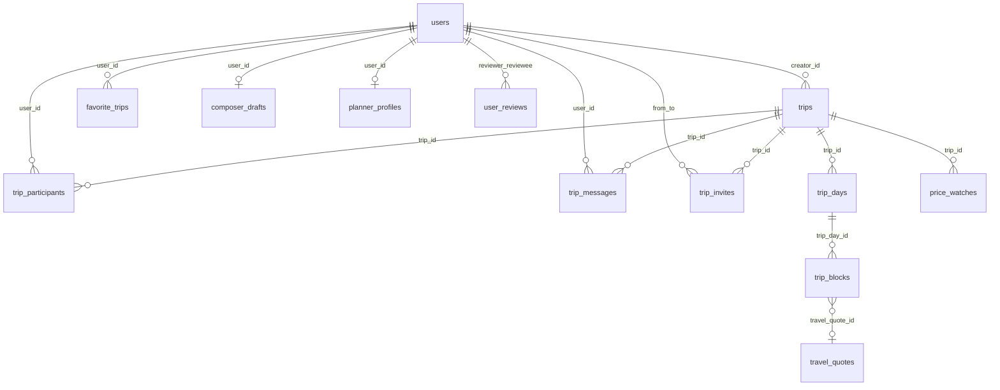
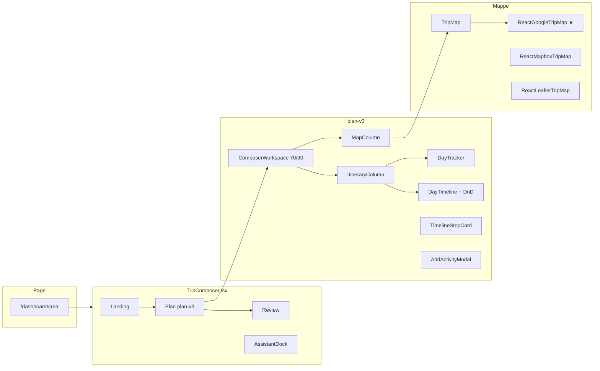
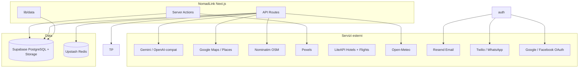
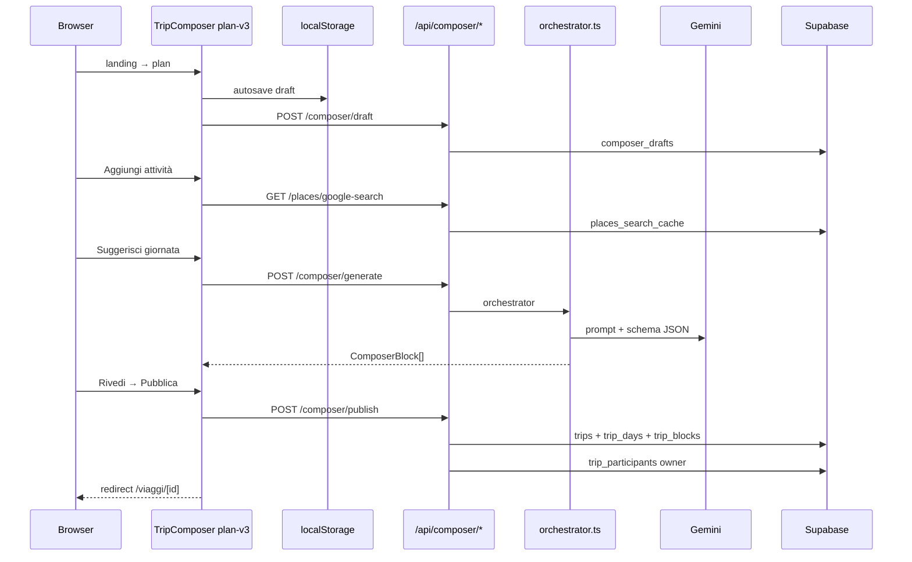

# Schema architetturale — NomadLink

Webapp di viaggi di gruppo: **Next.js 15 App Router**, auth **NextAuth v5**, dati su **Supabase PostgreSQL**, deploy su **Vercel**.

> Per il dettaglio del Trip Composer (orchestrator, blocchi, AI pipeline) vedi anche [`ARCHITECTURE-TRIP-COMPOSER.md`](./ARCHITECTURE-TRIP-COMPOSER.md).

---

## Stack tecnologico (panoramica)

| Layer | Tecnologie |
|-------|------------|
| **Runtime / framework** | Next.js 15.5, React 19, TypeScript 5, Turbopack (dev) |
| **Styling / UI** | Tailwind CSS v4, Radix UI, shadcn/ui, Framer Motion, Lucide |
| **Auth** | NextAuth v5 (JWT), bcryptjs, OAuth Google/Facebook |
| **Database** | Supabase (PostgreSQL), RLS, Storage (avatars) |
| **Validazione** | Zod 4 |
| **Mappe** | Google Maps (`@vis.gl/react-google-maps`) — attivo; Mapbox / Leaflet — legacy |
| **Drag & drop** | `@hello-pangea/dnd` (composer) |
| **Cache / rate limit** | Upstash Redis |
| **Test** | Vitest |
| **Deploy** | Vercel (+ Analytics, Speed Insights) |

---

## Layer 1 — Database (Supabase PostgreSQL)



### Entità principali

| Tabella | Ruolo | Tipi / note |
|---------|--------|-------------|
| `users` | Account, profilo, GDPR, email/phone verify | bcrypt password, username |
| `trips` | Viaggio pubblicato o bozza | `status`, `planning_mode`, `composer_version` |
| `trip_days` | Giorni itinerario | `day_index`, `day_date`, `title`, `summary` |
| `trip_blocks` | Tappe (attrazione, volo, hotel…) | enum `block_type`, `content` JSONB |
| `trip_participants` | Crew + ruoli | enum `participant_role` (owner/editor/viewer) |
| `composer_drafts` | Bozza composer (1 per utente) | `draft` JSONB, `current_step` |
| `planner_profiles` | Profilo viaggiatore (AI) | `profile` JSONB |
| `travel_quotes` | Cache quote voli/hotel | LiteAPI payload (legacy schema) |
| `trip_messages` | Chat di gruppo | per `trip_id` |
| `composer_ai_jobs` | Job AI async | polling status |
| `places_*_cache` | Cache Google Places | search + details |
| `api_cost_events` | Telemetria costi API | admin dashboard |

**Migrations:** `supabase/migrations/001` → `017`  
**Client DB:** `lib/supabase-admin.ts` (service_role, scritture), `lib/supabase-server.ts` (anon, letture pubbliche + RLS)

---

## Layer 2 — Dominio & accesso dati

```
types/                    ← contratti TypeScript
├── composer.ts           ComposerDraft, ComposerDay, ComposerBlock
├── trip.ts               TripWithRelations
├── planner.ts            PlannerProfile
└── user.ts               UserProfile

lib/data/                 ← repository (Server Components / API)
├── composer.ts           publishComposerTrip, fetchComposerItinerary
├── planner-profile.ts    draft + profilo cloud
├── trips.ts              discover, owned, public
├── trip-chat.ts          messaggi, read/hide
├── trip-invites.ts       inviti crew
└── users.ts, public-profile.ts

lib/composer/             ← logica dominio composer (~43 moduli)
├── days.ts, blocks.ts    CRUD giorni/tappe
├── orchestrator.ts       pipeline AI (cache → Gemini → mock)
├── planning.ts           raggruppamento slot, reorder
├── time-progression.ts   orari, distanze, transiti
├── draft-utils.ts        sync localStorage ↔ cloud
└── schemas.ts            Zod publish/generate

lib/queries/trips.ts      query SQL-oriented per feed viaggi
lib/maps/                 pins, coordinates, distance, map-view-mode
lib/places/               Nominatim, Google Places, cache DB
lib/ai/                   provider astratto (Gemini, OpenAI-compat)
lib/travel/               IATA / origin helpers
lib/liteapi/              hotel + voli (Nuitee Connect)
```

---

## Layer 3 — Backend (Next.js)

### 3.1 Middleware & Auth

```
middleware.ts
  → GDPR gate (/completa-registrazione)
  → NextAuth session su route protette

auth.ts + auth.config.ts
  → Providers: Credentials, Google, Facebook
  → JWT strategy (no Supabase Auth)

lib/auth-session.ts       path protetti
lib/auth/assert-trip-role.ts   RBAC viaggio
lib/auth/require-phone-verified.ts   gate publish/join
```

### 3.2 API Routes (`app/api/`)

| Gruppo | Route | Tech / integrazione |
|--------|-------|---------------------|
| **Auth** | `auth/[...nextauth]`, `register`, `verify-email`, `phone/*` | NextAuth, Resend, Twilio/WhatsApp |
| **Composer** | `composer/draft`, `generate`, `publish`, `assist`, `jobs/[id]` | Zod, AI, Supabase |
| **Places** | `places/search`, `reverse` | Nominatim OSM |
| | `places/google-search`, `details`, `photo` | Google Places + cache DB |
| **Travel** | `liteapi/hotels/search`, `liteapi/flights/search` | LiteAPI (Nuitee Connect) |
| **Chat** | `chat/groups`, `trips/[id]/chat`, `search` | Supabase realtime data |
| **Planner** | `planner/profile` | Supabase |
| **Utility** | `weather` | Open-Meteo |
| | `geo/approx` | Geolocalizzazione |
| | `admin/costs` | Cost dashboard |

**Guard:** `lib/api/request-guard.ts`, `lib/rate-limit.ts` + **Upstash Redis**

### 3.3 Server Actions (`actions/`)

| File | Operazioni |
|------|------------|
| `trips.ts` | create/update trip (form legacy) |
| `trip-management.ts` | delete, join |
| `trip-invites.ts` | send/respond invite |
| `favorites.ts` | toggle preferiti |
| `composer-draft.ts` | discard bozza |
| `user.ts` | avatar, profilo, password |
| `privacy.ts` | GDPR export/delete |
| `reviews.ts` | recensioni utenti |
| `images.ts` | search Pexels |

---

## Layer 4 — Frontend (App Router)

### 4.1 Routing

```
app/
├── layout.tsx              Root: fonts, Providers, Footer, Toaster
├── page.tsx                Landing / login
├── completa-registrazione  GDPR consent
├── privacy | termini | cookie
└── (main)/
    ├── layout.tsx          Navbar + main flex
    ├── dashboard/
    │   ├── page.tsx        Discover feed
    │   ├── cerca/          Ricerca viaggi
    │   ├── miei-viaggi/    Hub viaggi + bozze
    │   ├── preferiti/
    │   ├── crea/           ★ Trip Composer (fullscreen layout)
    │   ├── profilo/ | impostazioni/ | costi/
    │   └── viaggi/[id]/modifica/
    ├── viaggi/[id]/        Dettaglio viaggio pubblico
    │   └── prenota/
    ├── prenota/voli|hotel/ Affiliate booking
    └── u/[username]/       Profilo pubblico
```

### 4.2 Composer (funzionalità core)



**Wizard steps (attivi):** `landing → plan → review`  
**Step legacy (bozze vecchie):** `intake`, `setup` — normalizzati a `landing`  
**Stato:** React `useState` + `localStorage` + sync cloud (`/api/composer/draft`)  
**Tipi:** `ComposerDraft` → `ComposerDay[]` → `ComposerBlock[]` (content JSONB)

### 4.3 Altri domini UI

| Dominio | Componenti chiave | Pagine |
|---------|-------------------|--------|
| **Discover** | `DashboardClient`, `TripCard`, `TripDiscoverSearchBar` | `/dashboard`, `/cerca` |
| **I miei viaggi** | `MyTripsHub`, `ComposerDraftCard` | `/miei-viaggi` |
| **Viaggio pubblico** | `TripExperienceHub`, `TripDetailActions` | `/viaggi/[id]` |
| **Chat** | `TripGroupsChatDock`, `TripChatPanel` | dock globale |
| **Profilo** | sezioni profilo, recensioni | `/profilo`, `/u/*` |
| **Travel booking** | LiteAPI hotel + voli | composer + `/api/liteapi/*` |
| **UI kit** | `components/ui/*` (shadcn) | trasversale |

---

## Layer 5 — Servizi esterni



---

## Flusso end-to-end: Composer → Publish



---

## Mappa file → responsabilità

| Percorso | Layer |
|----------|-------|
| `supabase/migrations/*.sql` | Schema DB |
| `types/*.ts` | Contratti dominio |
| `lib/data/*.ts` | Repository |
| `lib/composer/*.ts` | Business logic composer |
| `app/api/**/route.ts` | REST API handlers |
| `actions/*.ts` | Server Actions (mutations) |
| `auth.ts`, `middleware.ts` | Auth & gate |
| `app/(main)/**/page.tsx` | Route UI (RSC) |
| `components/composer/plan-v3/*` | UI composer attiva |
| `components/trips/*` | UI viaggi |
| `components/maps/TripMap.tsx` | Facade mappa → Google |

---

## Note operative

1. **Auth:** identità su NextAuth (JWT); Supabase usato solo come DB, non come auth provider.
2. **Scritture:** quasi sempre via `supabaseAdmin` (service_role) dopo check sessione.
3. **Composer attivo:** `plan-v3` (tema scuro, DnD, timeline); backup in `old_composer/v1|v2|v3`.
4. **Mappe:** produzione usa **Google Maps** via `TripMap` → `ReactGoogleTripMap`; Mapbox/Leaflet restano come alternative/legacy.
5. **Bozze:** `localStorage` + tabella `composer_drafts` + step wizard persistito.

---

*Ultimo aggiornamento: luglio 2026*
